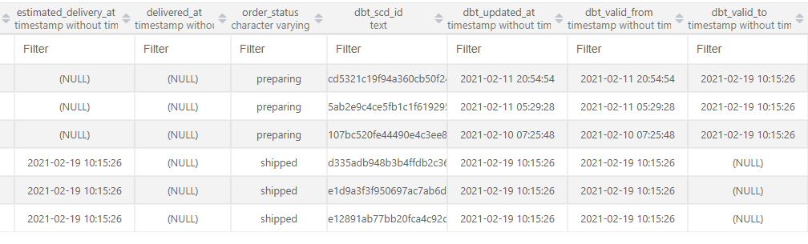
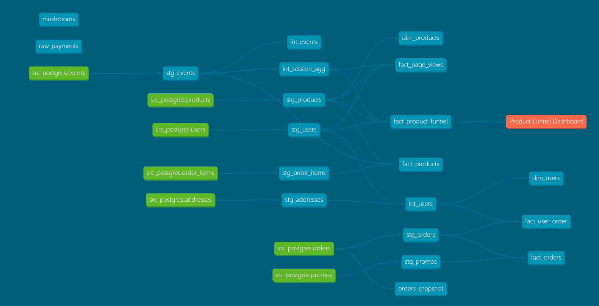

## WEEK 4 - Questions & Answers

## Part 1. dbt Snapshots
I have created a snapshot model called `order_snapshot` using the orders source in the /snapshots/ directory of our dbt project.
After running the `delivery-update.sh` script I notice that we have new rows in the model. Our order status and delivery at fields have changes.
In the existing rows "dbt_valid_to" date is filled marking these rows inactive. We have new active rows with updated order status and delivery at date where with "dbt_valid_to" is NULL. 



## Part 2. Modeling challenge
**Note**: To answer the product funnel Q&A I have added a new model called `fact_product_funnel` model. This is mainly based on `int_session_agg` model designed to created product funnel buckets.

## 1 How are our users moving through the product funnel?
**Answer**: Our users movement through product funnel is not optimal to say the least. We need to improve user experience on our site to achieve better conversion rate.


## 2 - Which steps in the funnel have largest drop off points?
**Answer**: We have a huge drop off between cart to checkout steps. From the session to cart we have a drop off rate of 38 percent. However, it jumps to 73 perecent from cart to checkout. 
It seems we have a major issue from cart to checkout steps which leads to this drop off.

SQL Query:
``` 
with base_fnl_metrics as (
     Select
        sum(total_sessions_fnl) as session_fnl,
        sum(total_sessions_cart_to_checkout_fnl) as cart_to_checkout_fnl,
        sum(total_sessions_checkout_fnl) as session_checkout_fnl,
        (sum(total_sessions_fnl) - sum(total_sessions_cart_to_checkout_fnl))::numeric as session_to_cart_diff,
        sum(total_sessions_cart_to_checkout_fnl) - sum(total_sessions_checkout_fnl)::numeric  as cart_to_checkout_diff
    FROM fact_product_funnel
 )

 Select 
 session_fnl as session_fnl_total,
 cart_to_checkout_fnl as cart_to_checkout_fnl_total,
 session_checkout_fnl as session_checkout_fnl_total,
 ROUND(session_to_cart_diff/session_fnl::numeric,2) as to_cart_variance,
 ROUND(cart_to_checkout_diff/cart_to_checkout_fnl::numeric,2) as checkout_to_cart_variance
 from base_fnl_metrics
 
```


## 3 - dbt exposure




## Part 3: Reflection questions -- please answer 3A
**Answer**: dbt is a modern framework and it can solve most of the problems we face today. It makes it easy to trace data lineage through Direct Acyclic Graph (DAG). We can visually trace data and bad design decisions and get rid of unnecessary complex dependencies.
Currently it is difficult to sort out data lineage due to lack of documentation. 
Another positive of dbt is that it is a SQL based transformations tool so there is no learning curve for Analysts and BI developers. They can quickly get pipelines setup without having to wait for data engineers. This will remove dependencies on the data engineering team. 
dbt comes with built-in tests that we define and run. Plus it gives us the option to create custom tests as SQL scripts. This will help us combat the data quality issues we are having.
It can save us uncountable hours in documentation is another feature that is integrated in dbt.
dbt easily integrates with Git which is another win as we are using Git as a source control.

dbt offers following advantages over legacy ETL tools:
* Data Lineage
* EmbeddedTesting
* No Learning curve (SQL)
* Documentation
* Git workflow (Source Control)

## 3B. Setting up for production / scheduled dbt run of your project
**Answer** We will be using dbt cloud to set up schedules that would run our dbt project and create desired model in the production database.
We will using mono repo that 
* dbt cloud offers following features:
* run your jobs on a schedule
* view logs for any historical invocation of dbt
* configure error notifications
* render your project's documentation
